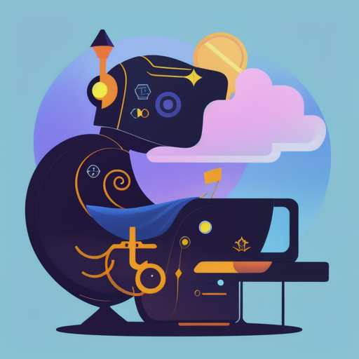

<!-- Improved compatibility of back to top link: See: https://github.com/othneildrew/Best-README-Template/pull/73 -->
<a name="readme-top"></a>
<!--
*** Thanks for checking out the Best-README-Template. If you have a suggestion
*** that would make this better, please fork the repo and create a pull request
*** or simply open an issue with the tag "enhancement".
*** Don't forget to give the project a star!
*** Thanks again! Now go create something AMAZING! :D
-->


<!-- PROJECT SHIELDS -->
<!--
*** I'm using markdown "reference style" links for readability.
*** Reference links are enclosed in brackets [ ] instead of parentheses ( ).
*** See the bottom of this document for the declaration of the reference variables
*** for contributors-url, forks-url, etc. This is an optional, concise syntax you may use.
*** https://www.markdownguide.org/basic-syntax/#reference-style-links
-->
[![Contributors][contributors-shield]][contributors-url]
[![Forks][forks-shield]][forks-url]
[![Stargazers][stars-shield]][stars-url]
[![Issues][issues-shield]][issues-url]
[![MIT License][license-shield]][license-url]
[![LinkedIn][linkedin-shield]][linkedin-url]


<!-- PROJECT LOGO -->
<br />
<div align="center">
  <a href="https://github.com/antony-ramos/GuildOps">
    
  </a>

<h3 align="center">GuildOps</h3>

  <p align="center">
    A Discord Bot to manage a World of Warcraft Guild
    <br />
    <a href="https://github.com/antony-ramos/GuildOps"><strong>Explore the docs »</strong></a>
    <br />
    <br />
    <a href="https://github.com/antony-ramos/GuildOps">View Demo</a>
    ·
    <a href="https://github.com/antony-ramos/GuildOps/issues">Report Bug</a>
    ·
    <a href="https://github.com/antony-ramos/GuildOps/issues">Request Feature</a>
  </p>
</div>


<!-- TABLE OF CONTENTS -->
<details>
  <summary>Table of Contents</summary>
  <ol>
    <li>
      <a href="#about-the-project">About The Project</a>
      <ul>
        <li><a href="#built-with">Built With</a></li>
      </ul>
    </li>
    <li>
      <a href="#getting-started">Getting Started</a>
      <ul>
        <li><a href="#prerequisites">Prerequisites</a></li>
        <li><a href="#installation">Installation</a></li>
      </ul>
    </li>
    <li><a href="#usage">Usage</a></li>
    <li><a href="#roadmap">Roadmap</a></li>
    <li><a href="#contributing">Contributing</a></li>
    <li><a href="#license">License</a></li>
    <li><a href="#contact">Contact</a></li>
    <li><a href="#acknowledgments">Acknowledgments</a></li>
  </ol>
</details>


<!-- ABOUT THE PROJECT -->
## About The Project

[![Product Name Screen Shot][product-screenshot]](https://example.com)

Here's a blank template to get started: To avoid retyping too much info. Do a search and replace with your text editor for the following: `antony-ramos`, `GuildOps`, `twitter_handle`, `linkedin_username`, `email_client`, `email`, `GuildOps`, `A Discord Bot to manage a World of Warcraft Guild`

<p align="right">(<a href="#readme-top">back to top</a>)</p>


### Built With

* [![Next][Next.js]][Next-url]
* [![React][React.js]][React-url]
* [![Vue][Vue.js]][Vue-url]
* [![Angular][Angular.io]][Angular-url]
* [![Svelte][Svelte.dev]][Svelte-url]
* [![Laravel][Laravel.com]][Laravel-url]
* [![Bootstrap][Bootstrap.com]][Bootstrap-url]
* [![JQuery][JQuery.com]][JQuery-url]

<p align="right">(<a href="#readme-top">back to top</a>)</p>


<!-- GETTING STARTED -->
## Getting Started

### Prerequisites

Some environment variables are needed to be set. 
* `DISCORD_TOKEN` : The token of your Discord Bot
* `DISCORD_GUILD_ID` : The ID of your Discord Guild
* `PG_URL` : The URL of your PostgreSQL database

### Installation

1. Check on Discord Portal how to create a bot and get its token
   * https://discord.com/developers/docs/getting-started
2. Get Guild ID from Discord
    * https://support.discord.com/hc/en-us/articles/206346498-Where-can-I-find-my-User-Server-Message-ID
3. Create a PostgreSQL database
    * https://www.postgresql.org/docs/9.3/tutorial-createdb.html
4. Clone the repo
    ```sh
    git clone
    ```
5. Get Discord Bot Token and Guild ID
    ```sh
    export DISCORD_TOKEN=your_discord_bot_token
    export DISCORD_GUILD_ID=your_discord_guild_id
    ```
6. Get PostgreSQL URL
    ```sh
    export PG_URL=your_postgresql_url
    ```
7. Build and Start Application
    ```sh
    docker-compose up --build
    ```

<p align="right">(<a href="#readme-top">back to top</a>)</p>


<!-- USAGE EXAMPLES -->
## Usage

Use this space to show useful examples of how a project can be used. Additional screenshots, code examples and demos work well in this space. You may also link to more resources.

_For more examples, please refer to the [Documentation](https://example.com)_

<p align="right">(<a href="#readme-top">back to top</a>)</p>


<!-- ROADMAP -->
## Roadmap

- [ ] Create Release Pipeline
- [ ] Better error management, errors send to Discord are too descriptive
- [ ] Better context timeout management
- [ ] Create Readme
- [ ] Add Log Level to config
- [ ] Add comments to every functions
- [ ] Add tests to every functions
- [ ] Add more logs for each level
- [ ] Add tracing for each request
- [ ] Add Validate for entities
- [ ] Add API as controller
- [ ] Add Usecase: player name is not discord name. Must implement a way to link them
- [ ] Fix In UpdatePlayer: placeholder $1 already has type int, cannot assign varchar
- [ ] Add In CreatePlayer id to player entity
- [ ] Fix DeleteStrike always return success
- [ ] Fix in SearchPlayer: player strikes must be import there not in usecase

See the [open issues](https://github.com/antony-ramos/GuildOps/issues) for a full list of proposed features (and known issues).

<p align="right">(<a href="#readme-top">back to top</a>)</p>

<!-- CONTRIBUTING -->
## Contributing

Contributions are what make the open source community such an amazing place to learn, inspire, and create. Any contributions you make are **greatly appreciated**.

If you have a suggestion that would make this better, please fork the repo and create a pull request. You can also simply open an issue with the tag "enhancement".
Don't forget to give the project a star! Thanks again!

1. Fork the Project
2. Create your Feature Branch (`git checkout -b feature/AmazingFeature`)
3. Commit your Changes (`git commit -m 'Add some AmazingFeature'`)
4. Push to the Branch (`git push origin feature/AmazingFeature`)
5. Open a Pull Request

<p align="right">(<a href="#readme-top">back to top</a>)</p>

<!-- LICENSE -->
## License

Distributed under the MIT License. See `LICENSE.txt` for more information.

<p align="right">(<a href="#readme-top">back to top</a>)</p>

<!-- CONTACT -->
## Contact

Antony Ramos - [@Discord](https://discord.com/users/271946692805263371)

Project Link: [https://github.com/antony-ramos/GuildOps](https://github.com/antony-ramos/GuildOps)

<p align="right">(<a href="#readme-top">back to top</a>)</p>


<p align="right">(<a href="#readme-top">back to top</a>)</p>


<!-- MARKDOWN LINKS & IMAGES -->
<!-- https://www.markdownguide.org/basic-syntax/#reference-style-links -->
[contributors-shield]: https://img.shields.io/github/contributors/antony-ramos/GuildOps.svg?style=for-the-badge
[contributors-url]: https://github.com/antony-ramos/GuildOps/graphs/contributors
[forks-shield]: https://img.shields.io/github/forks/antony-ramos/GuildOps.svg?style=for-the-badge
[forks-url]: https://github.com/antony-ramos/GuildOps/network/members
[stars-shield]: https://img.shields.io/github/stars/antony-ramos/GuildOps.svg?style=for-the-badge
[stars-url]: https://github.com/antony-ramos/GuildOps/stargazers
[issues-shield]: https://img.shields.io/github/issues/antony-ramos/GuildOps.svg?style=for-the-badge
[issues-url]: https://github.com/antony-ramos/GuildOps/issues
[license-shield]: https://img.shields.io/github/license/antony-ramos/GuildOps.svg?style=for-the-badge
[license-url]: https://github.com/antony-ramos/GuildOps/blob/master/LICENSE.txt
[linkedin-shield]: https://img.shields.io/badge/-LinkedIn-black.svg?style=for-the-badge&logo=linkedin&colorB=555
[linkedin-url]: https://linkedin.com/in/linkedin_username
[product-screenshot]: images/screenshot.png
[Next.js]: https://img.shields.io/badge/next.js-000000?style=for-the-badge&logo=nextdotjs&logoColor=white
[Next-url]: https://nextjs.org/
[React.js]: https://img.shields.io/badge/React-20232A?style=for-the-badge&logo=react&logoColor=61DAFB
[React-url]: https://reactjs.org/
[Vue.js]: https://img.shields.io/badge/Vue.js-35495E?style=for-the-badge&logo=vuedotjs&logoColor=4FC08D
[Vue-url]: https://vuejs.org/
[Angular.io]: https://img.shields.io/badge/Angular-DD0031?style=for-the-badge&logo=angular&logoColor=white
[Angular-url]: https://angular.io/
[Svelte.dev]: https://img.shields.io/badge/Svelte-4A4A55?style=for-the-badge&logo=svelte&logoColor=FF3E00
[Svelte-url]: https://svelte.dev/
[Laravel.com]: https://img.shields.io/badge/Laravel-FF2D20?style=for-the-badge&logo=laravel&logoColor=white
[Laravel-url]: https://laravel.com
[Bootstrap.com]: https://img.shields.io/badge/Bootstrap-563D7C?style=for-the-badge&logo=bootstrap&logoColor=white
[Bootstrap-url]: https://getbootstrap.com
[JQuery.com]: https://img.shields.io/badge/jQuery-0769AD?style=for-the-badge&logo=jquery&logoColor=white
[JQuery-url]: https://jquery.com 